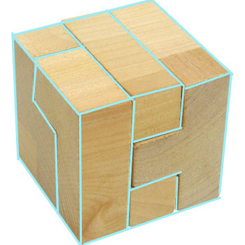
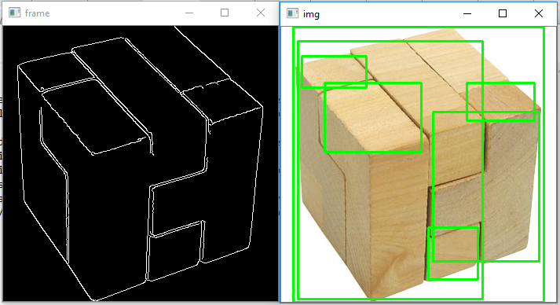

https://stackoverflow.com/questions/57542916/how-to-detect-all-the-separation-lines-in-image-in-xamarin-or-c-sharp-or-python

How to detect all the separation lines in image in xamarin or c# or python?
Asked 3 years, 4 months ago
Modified 3 years, 4 months ago
Viewed 339 times
1

I need to detect all the lines (edges) in an image an their positions in my xamarin application .

like in the image attached .

I have tried openCV in python but still I did not get all the lines , I only got boundary boxes around the objects and only straight lines , but I need to detect the sloping lines too .

here is the python code I used :`

blur = cv2.GaussianBlur(img, (3,3), 0)
canny = cv2.Canny(blur, l_th, u_th)
dilated = cv2.dilate(canny, None, iterations=3)
contours, hierarchy = cv2.findContours(dilated, cv2.RETR_TREE, cv2.CHAIN_APPROX_NONE)
for contour in contours:
    (x, y, w, h) = cv2.boundingRect(contour)
    cv2.rectangle(coloured_img, (x, y), (x+w, y+h), (0, 255, 0), 2)

the original image :

the output that I want :

the output that I got :

any suggestions please ?

    c#opencvxamarinobject-detectionstraight-line-detection

Share
Improve this question
Follow
asked Aug 18, 2019 at 8:32
maria nabil's user avatar
maria nabil
14133 silver badges99 bronze badges
Add a comment
1 Answer
Sorted by:
1

Try HoughLinesP in OpenCV

import cv2
import numpy as np

img = cv2.imread('dave.jpg')
gray = cv2.cvtColor(img,cv2.COLOR_BGR2GRAY)
edges = cv2.Canny(gray,50,150,apertureSize = 3)
minLineLength = 100
maxLineGap = 10
lines = cv2.HoughLinesP(edges,1,np.pi/180,100,minLineLength,maxLineGap)
for x1,y1,x2,y2 in lines[0]:
    cv2.line(img,(x1,y1),(x2,y2),(0,255,0),2)

cv2.imwrite('houghlines5.jpg',img)

More info - OpenCV doc
