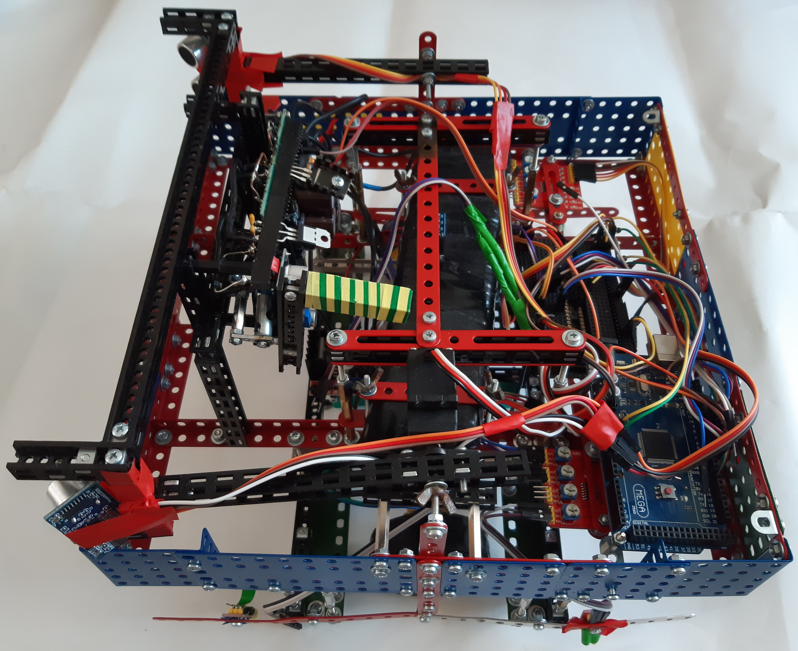
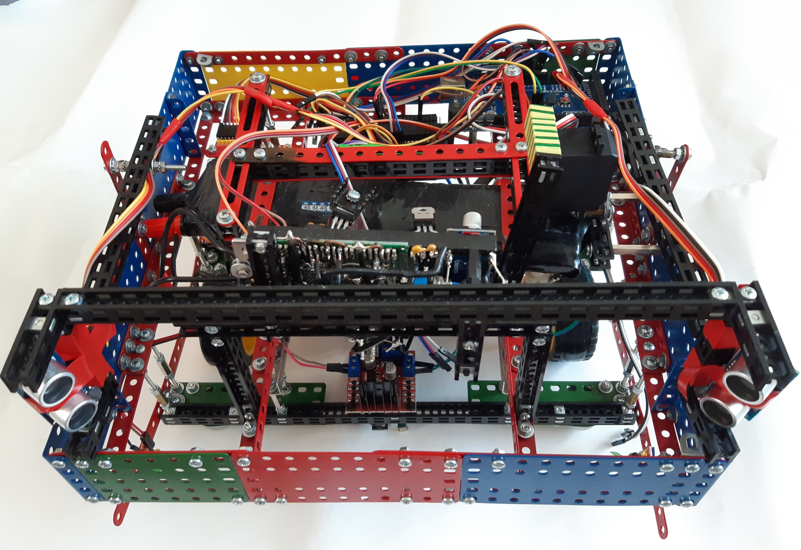
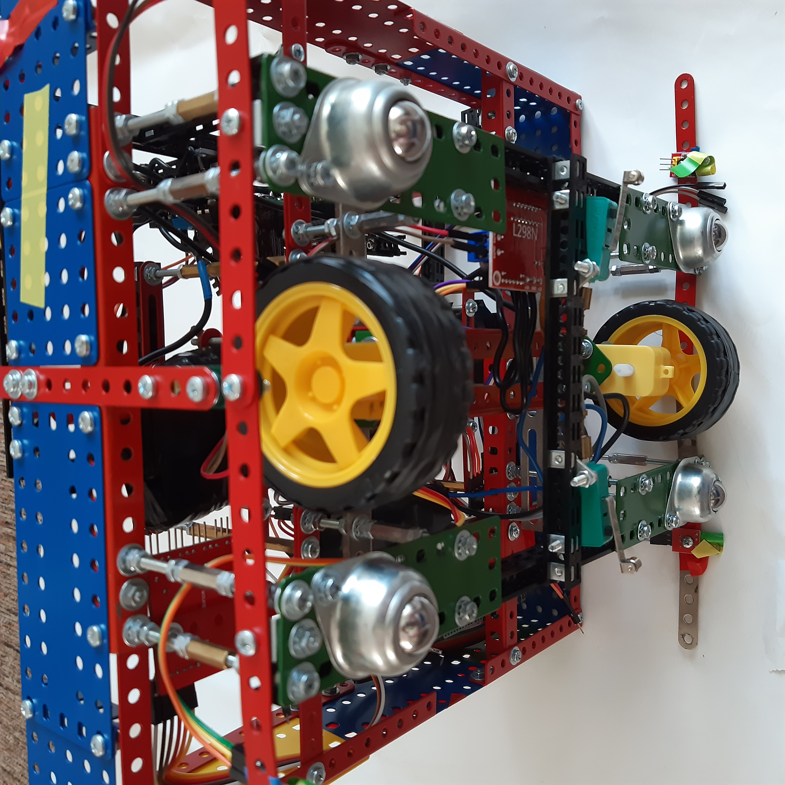
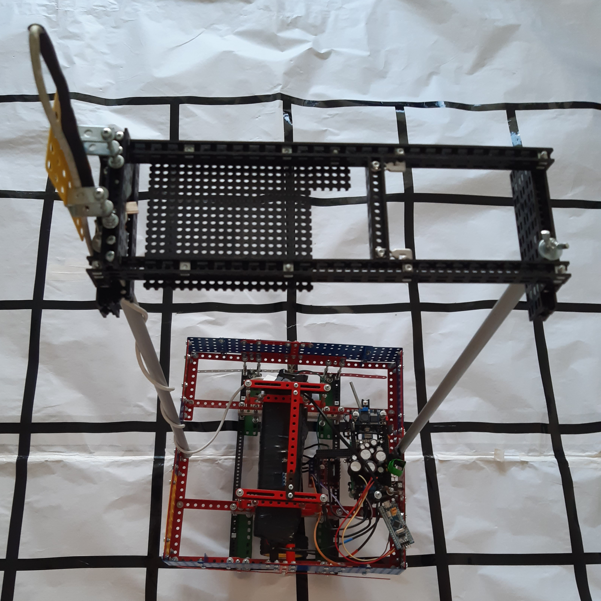
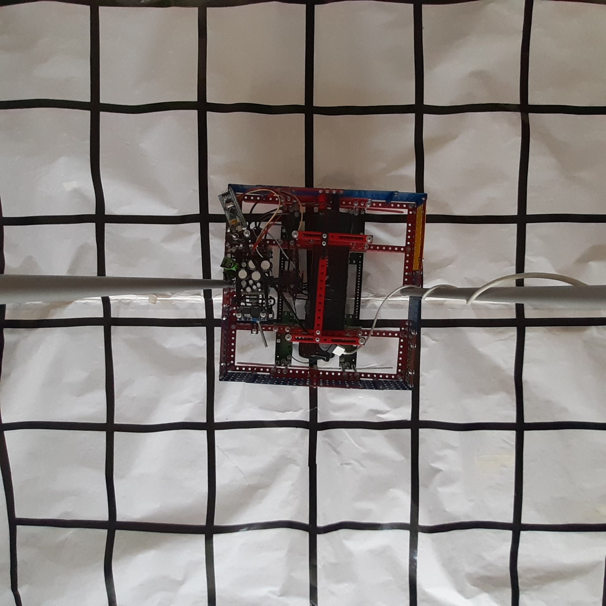

# Závěr Ročníku 2022
Robot nebyl dostatečně připraven. Pro zprovoznění rezervního plánu bylo málo času. Kámen úrazu bylo vyhoření motoru. Předtím se mi málem podařilo umístit 3 a potom 2 plechovky na svojí čáru při dvou soubojích.

# Cíl na další rok
Uskutečnit nápad s rozpoznáváním obrazu. 
Komunikace mezi STM a Mobilním zařízením přes USB.

# Fotky soutěžního robota

# BulldozerPhone
Kategorie: Ketchup House
BulldozerPhone je robot postavený převážně z Merkuru a Totemu. Mým cílem je zkusit si programovat mobilní aplikaci a využít mobilní senzory. Na mobilu poběží plně autonomní program, proto je zde odkaz na git: 
https://github.com/PNmJunior/RB2022-TymRECYLKON-KetH-BulldozerPhone.git 
Načerpané zkušenosti mám v plánu použít v dalších projektech.
Konstrukce je maximálních rozměrů s vysokým stojanem na mobil. Díky širokoúhlé kameře a výšce kolem 60 cm nad povrchem, má kamera dostatečný přehled o dění kolem robota. Velkou výhodou je těžká spodní část robota. Díky hmotnost 2,8kg je robot relativně stabilní a v podstatě se nedá převrátit. Vrátí se zpět na podvozek i při vychýlení o 60°.

